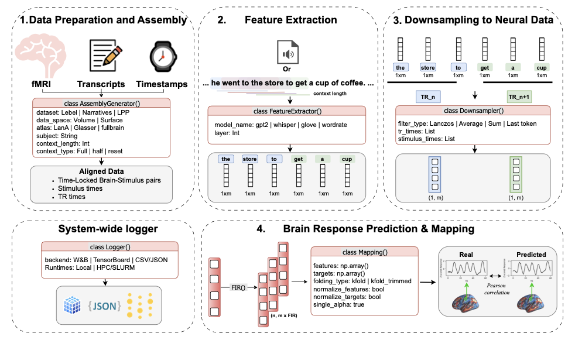

# LITcoder

This repository accompanies the paper "LITcoder: A General-Purpose Library for Building and Comparing Encoding Models" ([arXiv:2509.09152](https://www.arxiv.org/abs/2509.09152)). It provides a modular pipeline to align continuous stimuli with fMRI data, build encoding models, and evaluate them.

The steps below prepare your environment and data to reproduce experiments on three story-listening datasets: Narratives, Little Prince (LPP), and LeBel.



---

## 1) Prerequisites

- Python 3.10+
- fMRIPrep
- BIDS-formatted datasets (Narratives, Little Prince, LeBel)

Environment setup:
```bash
git clone git@github.com:GT-LIT-Lab/litcoder_core.git
cd litcoder_core
conda create -n litcoder -y python=3.12.8
conda activate litcoder
conda install pip
pip install -e .
```


## 2) fMRIPrep: Common Command Template

Use the following template for each participant and dataset:

```bash
fmriprep BIDS_DIR OUTPUT_DIR participant \
  --participant_label PARTICIPANT \
  --output-spaces MNI152NLin2009cAsym:res-2 \
  --ignore slicetiming \
  --skip_bids_validation \
  --fs-no-reconall \
  --nprocs 8
```

- Replace `BIDS_DIR`, `OUTPUT_DIR`, and `PARTICIPANT` per your setup.
- After preprocessing, copy or symlink the required outputs into this repo under `data/<dataset>/neural_data/` following the layouts below.

---

## 3) Repository Data Roots

- Narratives: `data/narratives/neural_data/`
- Little Prince: `data/little_prince/neural_data/`
- LeBel: `data/lebel/neural_data/`

Unless specified, each subject has a subfolder named by the subject label (e.g., `sub-256`, `sub-EN058`).

---

## 4) Dataset-Specific Setup

To keep this README concise, each dataset has its own short guide in [docs](docs/):

### 4.1 Narratives
See: [docs/narratives.md](docs/narratives.md)

Key requirements:
- BOLD NIfTI in `MNI152NLin2009cAsym:res-2`
- narratives_data.pkl under `data/narratives/neural_data/`
- Source for `narratives_data.pkl`: [data/narratives/neural_data/narratives_data.pkl](data/narratives/neural_data/narratives_data.pkl)

### 4.2 Little Prince (LPP)
See: [docs/little_prince.md](docs/little_prince.md)

Key requirements:
- BOLD NIfTI for all runs in `MNI152NLin2009cAsym:res-2`
- Per-subject `lpp_data.pkl` under `data/little_prince/neural_data/`
- Source for `lpp_data.pkl`: [data/little_prince/neural_data/lpp_data.pkl](data/little_prince/neural_data/lpp_data.pkl)

### 4.3 LeBel
See: [docs/lebel.md](docs/lebel.md)

Key requirements:
- Run `fmri_processing/to_mni_lebel.py` after fMRIPrep
- Place per-subject pickles directly under `data/lebel/neural_data/`:
  - `noslice_sub-<SUBJECT_ID>_story_data.pkl`
  - `noslice_sub-<SUBJECT_ID>_story_data_surface.pkl`
- Source for `lebel_data.pkl`: [data/lebel/neural_data/lebel_data.pkl](data/lebel/neural_data/lebel_data.pkl)

---
## 5) Replicating the experiments
Under `scripts/`, we provide SLURM and bash scripts to run the experiments.

You'll find the scripts for narratives under `scripts/narratives_scripts/`.
For lpp, you'll find the scripts under `scripts/lpp_scripts/`.
For lebel, they will be under `scripts`

## 5a) Generating paper figures.
This step is very easy to do and is done by the following commands:
```bash
cd generate_figures
conda activate litcoder
bash run_zip_py.sh
```
This will generate the figures in the paper under analysis_litcoder_figures.


## 6) Quick tutorial: Narratives (mirrors training_files/train_narratives.py)

This library uses the same core modules across datasets, but here’s the exact flow for Narratives as implemented in `training_files/train_narratives.py`:
- Create an assembly with `dataset_type="narratives"`, providing `data_dir`, `subject`, `tr`, `lookback`, `context_type`, and `use_volume`.
- Build `LanguageModelFeatureExtractor`, extract all layers per story (with caching via `ActivationCache`), and select `layer_idx`.
- Downsample to TRs with `Downsampler.downsample(...)` using `--downsample_method` and Lanczos parameters if applicable.
- Apply FIR delays with `FIR.make_delayed` using `--ndelays`.
- Concatenate the delayed features and brain data for the story order used in the script (currently `['21styear']`), then trim `[14:-9]` before modeling.
- Fit nested CV ridge via `fit_nested_cv(features=X, targets=Y, ...)` with your chosen folding and ridge parameters.

Concrete CLI example:

```bash
python training_files/train_narratives.py \
  --data_dir data/narratives/neural_data \
  --subject sub-256 \
  --tr 1.5 \
  --model_name gpt2-small \
  --layer_idx 9 \
  --context_type fullcontext \
  --downsample_method lanczos \
  --lanczos_window 3 \
  --lanczos_cutoff_mult 1.0 \
  --ndelays 8 \
  --folding_type kfold \
  --n_outer_folds 5 \
  --n_inner_folds 5 \
  --chunk_length 20 \
  --singcutoff 1e-10 \
  --logger_backend tensorboard \
  --results_dir results/narratives_demo
```


## ✅ Tests Currently Ran

We tested the following training scripts on a clean setup using the steps above:

| Dataset | Script | Status | Results |
|---------|--------|--------|---------|
| **LeBel** | `train_lebel.py` | ✅ | [View Results](https://wandb.ai/neurotaha/litcoderpublic_lebel_test_release?nw=nwuserneurotaha) |
| **LeBel** | `train_lebel_speech.py` | ✅ | [View Results](https://wandb.ai/neurotaha/litcoderpublic_lebel_speech_test_release/runs/3x5qpzc2?nw=nwuserneurotaha) |
| **LeBel** | `train_lebel_embeddings.py` | ✅ | [View Results](https://wandb.ai/neurotaha/litcoderpublic_lebel_embeddings_test_release/runs/m3w8guqe?nw=nwuserneurotaha) |
| **LeBel** | `train_lebel_wordrate.py` | ✅ | [View Results](https://wandb.ai/neurotaha/litcoderpublic_lebel_wordrate_test_release/runs/n1nei7qe/workspace?nw=nwuserneurotaha) |
| **Narratives** | `train_narratives.py` | ✅ | [View Results](https://wandb.ai/neurotaha/litcoderpublic_narratives_test_release?nw=nwuserneurotaha) |
| **Narratives** | `train_narratives_embeddings.py` | ✅ | [View Results](https://wandb.ai/neurotaha/litcoderpublic_narratives_embeddings_release/runs/y2jq2k99?nw=nwuserneurotaha) |
| **Narratives** | `train_narratives_speech.py` | ✅ | [View Results](https://wandb.ai/neurotaha/litcoderpublic_narratives_test_speech?nw=nwuserneurotaha) |
| **Narratives** | `train_narratives_wordrate.py` | ✅ | [View Results](https://wandb.ai/neurotaha/litcoderpublic_narratives_wordrate_release?nw=nwuserneurotaha) |
| **Little Prince** | `train_lpp_all.py` | ✅ | [View Results](https://wandb.ai/neurotaha/litcoderpublic_lpp_test_all_release?nw=nwuserneurotaha) |
| **Little Prince** | `train_lpp_speech.py` | ✅ | [View Results](https://wandb.ai/neurotaha/litcoderpublic_lpp_test_speech_release/runs/uiwpa5zy?nw=nwuserneurotaha) |
| **Little Prince** | `train_lpp_embeddings.py` | ✅ | [View Results](https://wandb.ai/neurotaha/litcoderpublic_lpp_test_embeddings_release?nw=nwuserneurotaha) |
| **Little Prince** | `train_lpp_wordrate.py` | ✅ | [View Results](https://wandb.ai/neurotaha/litcoderpublic_lpp_test_wordrate_release/runs/tyymhjyf?nw=nwuserneurotaha) |

---
## Project Status and Contributions

Please refer to the original [LITcoder](https://github.com/GT-LIT-Lab/litcoder_core) for any questions, documentation and more.
Documentation for the LITcoder core library can be found [here](https://gt-lit-lab.github.io/litcoder_core/).
Tutorials for the LITcoder library can be found [here](https://litcoder-brain.github.io/tutorials.html).

---


## Citation

If you use **LITcoder** in your research, please cite:
```bibtex
@misc{binhuraib2025litcodergeneralpurposelibrarybuilding,
      title={LITcoder: A General-Purpose Library for Building and Comparing Encoding Models}, 
      author={Taha Binhuraib and Ruimin Gao and Anna A. Ivanova},
      year={2025},
      eprint={2509.09152},
      archivePrefix={arXiv},
      primaryClass={cs.CL},
      url={https://arxiv.org/abs/2509.09152}, 
}
```